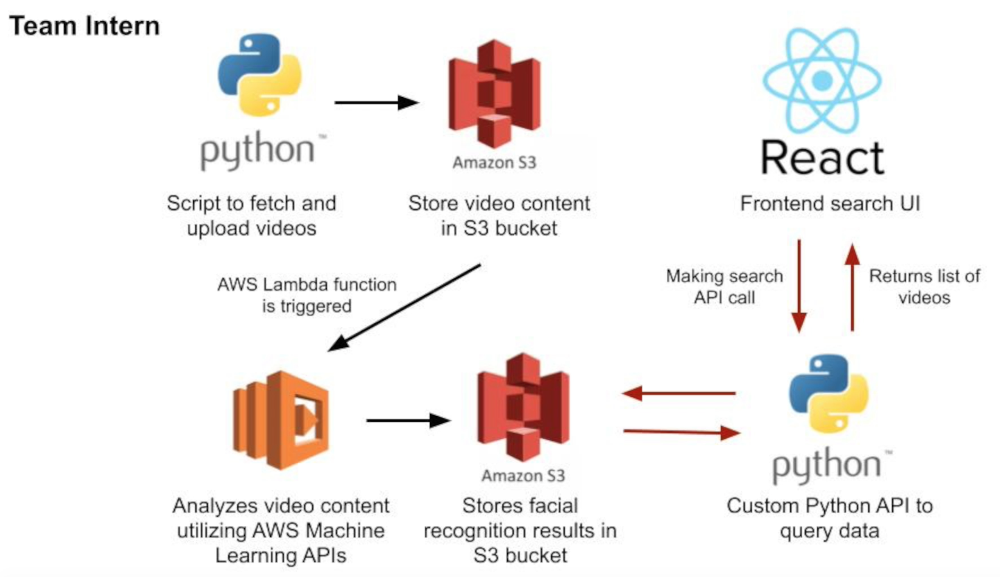

## Face-query

*face-query* is a project built by a team of 4 interns at CBS Interactive's Summer 2019 company-wide hackathon.
Our goal was to build a searchable video library that allows users to search for a celebrity and discover videos
that they appear in, as well as an estimate of where in the video they appear.

## How does it work?

The project is composed of three key pieces:

1. **Building the video library**: Python script that fetches videos from different sources (such as YouTube) and uploads videos to an AWS S3 bucket, which triggers the video analysis.
    
2. **Automated video analysis**: AWS Lambda function scans our S3 bucket for the new video and determines which celebrities are in the video, leveraging the AWS Rekognition Machine Learning API. The results of the analysis are stored in another S3 bucket.
    
3. **Displaying the results**: Custom Python API that queries our results bucket, and web app built with React that allows the user to search for a celebrity.

## System Architecture

